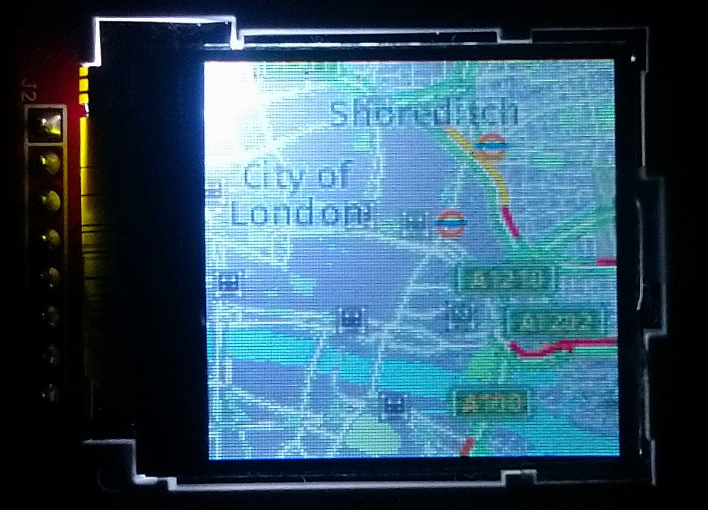
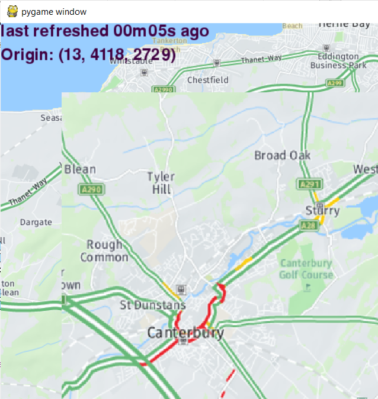

# Traffic display using Here Maps and optionally an LCD display

## The goal 

The goal of this project is to display the current traffic in your location on a dedicated. always on device. The source of the traffic information is [Here.com](http://www.here.com) which offers a very useful free tier. 

My reasoning is as follows: if you are in a hurry, it might be useful to check the traffic conditions with a single look at a monitor or an LCD display, without taking your phone out of the pocket, unlocking, running Maps, etc.

The project is written in Python 3 and requires either PyGame or PIL with an optional LCD library.

## Supported devices

The devices supported at this moment:
+ Monitor display: any Linux/MAC/Windows PC,including Raspberry Pi
+ ILI9341 LCD display: Raspberry Pi 

Note: in case the LCD display is smaller than the entire map, the application automatically scrolls the map to show a greater area.

## Examples

### LCD

### Monitor display

## Files

### config.json description

You need to create an account in [Here.com](http://www.here.com), receive an app_id and app_code and provide them in `config.json`. There are two example config files:
* `example-config.json` for PyGame
* `example-config-lcd.json` for PIL & LCD

### show_pil.py

Displays the traffic using the LCD (if configured), otherwise shows the traffic using PIL. The latter method is for debugging only.

### show_pygame.py

Displays the traffic using Pygame on the computer monitor.

## To do

Planned:
- refactor into just one executable file with plugins for multiple display options
- add weather information
- add mouse support

## Requirements

Monitor display needs either PyGame or PIL. ILI9341 needs the specific library and PIL.

Libraries for PC monitor display (you need one of the two, but obviously PyGame gives you more capabilities)
* PIL
* PyGame

Libraries for LCD display
* PIL
* [https://github.com/adafruit/Adafruit_ILI9341](https://github.com/adafruit/Adafruit_ILI9341)

## License

[MIT License](LICENSE)

